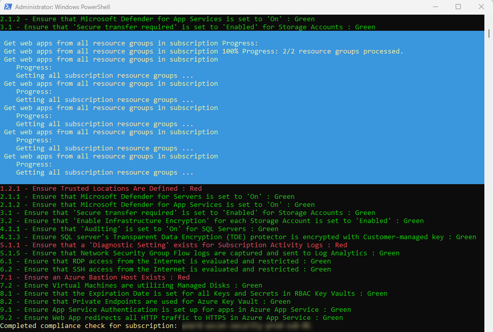
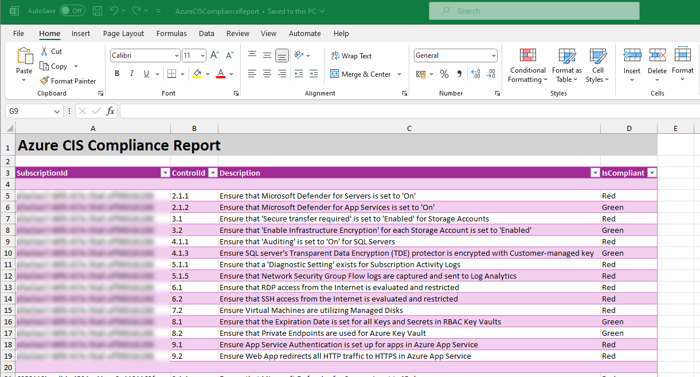

# Microsoft Azure CIS Compliance Checker

## Introduction

The Microsoft Azure CIS Compliance Checker is a PowerShell script designed to evaluate the compliance of Azure environments against the Center for Internet Security (CIS) benchmarks. This project was created by Shaun Hardneck as a pet project to save time on reviewing Microsoft Azure environments.

## Why This Script Was Created

As cloud environments grow more complex, maintaining security compliance becomes increasingly challenging. This script aims to simplify and automate the process of checking Azure subscriptions against critical security controls defined by the CIS benchmarks. By running this script, you can quickly identify compliance gaps and take necessary actions to secure your Azure resources.

## Screenshots
**Running the Script**


**Export Report**



## How to Run the Script

1. **Clone the Repository**:
    ```sh
    git clone https://github.com/thatlazyadmin/Microsoft-Azure/CIS-Assessment/AzureCISChecker.git
    cd AzureCISComplianceChecker
    ```

2. **Run the Script**:
    Open a PowerShell terminal and navigate to the directory where the script is located. Run the script using the following command:
    ```powershell
    .\AzureCISChecker.ps1
    ```

3. **Follow the Prompts**:
    - The script will prompt you to import the required modules. Type `yes` or `no` to proceed.
    - Enter your Azure Tenant ID when prompted.

4. **View the Results**:
    The script will output the compliance status for each control directly in the terminal. Additionally, the results will be exported to an Excel file named `AzureCISComplianceReport.xlsx` in the same directory.

## Understanding Compliance Status

- **Green**: Indicates that the control is compliant.
- **Red**: Indicates that the control is not compliant and requires attention.

## Controls Being Checked

The script checks the following CIS controls:

### Identity and Access Management
- **1.1.3** Ensure Multi-Factor Auth Status is Enabled for all Non-Privileged Users
- **1.1.4** Ensure that 'Allow users to remember multi-factor authentication on devices they trust' is Disabled
- **1.2.1** Ensure Trusted Locations Are Defined

### Microsoft Defender for Cloud
- **2.1.1** Ensure that Microsoft Defender for Servers is set to 'On'
- **2.1.2** Ensure that Microsoft Defender for App Services is set to 'On'

### Storage Accounts
- **3.1** Ensure that 'Secure transfer required' is set to 'Enabled' for Storage Accounts
- **3.2** Ensure that 'Enable Infrastructure Encryption' for each Storage Account is set to 'Enabled'

### Database Services
- **4.1.1** Ensure that 'Auditing' is set to 'On' for SQL Servers
- **4.1.3** Ensure SQL server's Transparent Data Encryption (TDE) protector is encrypted with Customer-managed key

### Logging and Monitoring
- **5.1.1** Ensure that a 'Diagnostic Setting' exists for Subscription Activity Logs
- **5.1.5** Ensure that Network Security Group Flow logs are captured and sent to Log Analytics

### Networking
- **6.1** Ensure that RDP access from the Internet is evaluated and restricted
- **6.2** Ensure that SSH access from the Internet is evaluated and restricted

### Virtual Machines
- **7.1** Ensure an Azure Bastion Host Exists
- **7.2** Ensure Virtual Machines are utilizing Managed Disks

### Key Vault
- **8.1** Ensure that the Expiration Date is set for all Keys and Secrets in RBAC Key Vaults
- **8.2** Ensure that Private Endpoints are used for Azure Key Vault

### App Service
- **9.1** Ensure App Service Authentication is set up for apps in Azure App Service
- **9.2** Ensure Web App redirects all HTTP traffic to HTTPS in Azure App Service

## Future Updates

More checks and controls will be added in the next version of the script to enhance its coverage and utility.

## Notes
Created by: Shaun Hardneck  
Blog: [That Lazy Admin](https://www.thatlazyadmin.com)

This script is intended for educational and informational purposes only. Please review and test thoroughly before using it in a production environment.
